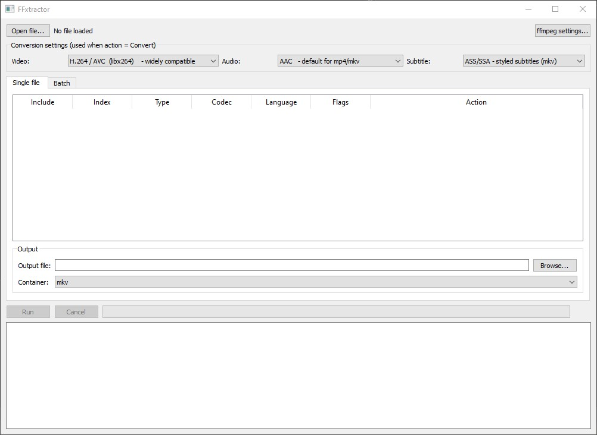

# FFxtractor

FFxtractor is a lightweight PyQt5 GUI for inspecting, selecting, copying, converting, and discarding streams in media containers through FFmpeg and FFprobe.

It is designed for users who want direct control over the streams of a media file without having to build FFmpeg command lines manually.

## Features

- Open and inspect supported media files through FFprobe.
- Display detected streams with:
  - stream index
  - stream type
  - codec
  - language
  - forced/default flags
- Per-stream actions:
  - **Copy** — keep the original codec.
  - **Convert** — encode using the selected codec preset.
  - **Discard** — exclude the stream from the output.
- Explicit per-stream inclusion checkboxes.
- Single-file processing.
- Batch processing using the stream rules configured from the loaded reference file.
- Progress reporting based primarily on media duration, with a file-size fallback when FFmpeg reports `time=N/A`.
- FFmpeg command output and processing messages in the application log.
- Automatic FFmpeg/FFprobe detection.
- Manual FFmpeg/FFprobe path configuration.
- Persistent FFmpeg/FFprobe paths through Qt settings.
- Output container selection:
  - MKV
  - MP4
  - AVI
  - WebM
  - MOV
- Separate codec presets for video, audio, and subtitles.
- Output filenames in batch mode use the pattern `<input>_out.<container>`.

## Requirements

### Runtime

- Windows 10
- Python 3.9 or newer
- PyQt5
- FFmpeg
- FFprobe

FFmpeg and FFprobe are external dependencies and are not included in this repository.

`ffmpeg.exe` and `ffprobe.exe` must either be available through the system `PATH`, be placed in the application's `bin` directory, or be selected manually from the **ffmpeg settings...** dialog.

The application validates the configured executables by invoking their `-version` command.

## Installation

Clone the repository and create a Python environment:

```text
python -m venv .venv
.venv\Scripts\activate
```

Install the Python dependency:

```text
python -m pip install --upgrade pip
pip install -r requirements.txt
```

Install FFmpeg separately and make sure both `ffmpeg.exe` and `ffprobe.exe` are available.

Run the application:

```text
python ffxtractor.py
```

## FFmpeg setup

On startup FFxtractor attempts to locate FFmpeg and FFprobe in this order:

1. `bin\ffmpeg.exe` and `bin\ffprobe.exe` beside the application.
2. Executables available through `PATH`.
3. The fallback path `C:\ffmpeg\bin\`.
4. Manual selection through **ffmpeg settings...**.

The selected paths are stored using Qt `QSettings`, so they do not need to be selected again on every launch.

## Single-file workflow

1. Click **Open file...**.
2. Select a supported media file.
3. FFprobe reads the container and stream information.
4. Review the stream table.
5. For each stream:
   - leave **Include** enabled to process it;
   - select **Copy** to preserve the original codec;
   - select **Convert** to use the selected codec preset;
   - select **Discard** to remove it.
6. Select the output filename and container.
7. Click **Run**.
8. FFmpeg output is shown in the application log.

When a stream is unchecked, FFxtractor treats it as `Discard`, regardless of the selected action.

## Batch workflow

Batch mode uses the stream rules configured in the **Single file** tab as a template.

1. Open a representative file in **Single file**.
2. Configure the desired stream actions and inclusion states.
3. Open the **Batch** tab.
4. Add the files to process.
5. Select an output folder.
6. Select the output container.
7. Click **Run Batch**.

Each output file is named:

```text
<input_name>_out.<container>
```

### Important batch limitation

Batch rules are matched using the original stream **index and codec type**.

This means the reference file and batch files should have compatible stream layouts. Files with different stream indexes, missing streams, or additional streams may not receive the intended rules.

Streams that do not match a configured rule currently default to **Copy**.

For predictable batch results, use files produced by the same workflow or otherwise verify that their stream layouts are compatible.

## Codec presets

### Video

- H.264 / AVC — `libx264`
- H.265 / HEVC — `libx265`
- VP9 — `libvpx-vp9`
- MPEG-4 Part 2 — `mpeg4`

### Audio

- AAC — `aac`
- MP3 — `libmp3lame`
- Vorbis — `libvorbis`
- Opus — `libopus`
- FLAC — `flac`
- PCM 16-bit — `pcm_s16le`

### Subtitles

- ASS/SSA — `ass`
- SRT — `srt`
- WebVTT — `webvtt`
- MP4 native subtitles — `mov_text`

Codec/container compatibility is determined by FFmpeg. Selecting a codec that is not supported by the selected output container can cause FFmpeg to fail.

## Progress handling

FFxtractor normally calculates progress from FFmpeg's reported processing time and the media duration.

Some FFmpeg operations can report `time=N/A`. These lines are hidden from the GUI log to reduce visual noise. When possible, FFxtractor falls back to the reported output size compared with the input file size.

The size-based method is only an estimate and should not be interpreted as an exact percentage for transcoding jobs.

## Current architecture

The current project is intentionally implemented as a single Python file:

```text
ffxtractor.py
```

The main components are:

- `FFmpegManager` — FFmpeg/FFprobe discovery, validation, and persistent configuration.
- `probe_file()` — FFprobe JSON inspection.
- `FFmpegWorker` — asynchronous single-file FFmpeg execution.
- `BatchWorker` — sequential batch execution.
- `MainWindow` — PyQt5 user interface and command construction.

The application uses `QThread` so FFmpeg processing does not block the main GUI thread.

## Known limitations

The following limitations are present in the current implementation:

- Batch stream rules depend on stream index and codec type matching.
- Batch processing does not automatically adapt rules by language, title, disposition, or other stream metadata.
- Unknown/unmatched batch streams currently default to `Copy`.
- Progress based on output size is only an estimate.
- Codec/container compatibility is delegated to FFmpeg.
- There is currently no automated application-level test suite.
- The project is currently maintained as a single Python source file.

## Safety and data handling

FFxtractor invokes FFmpeg and FFprobe locally through `subprocess`. It does not require a network connection for media processing.

Output files are created using FFmpeg's `-y` option after FFxtractor asks the user for confirmation when the target already exists.

Always keep backups of important source media before performing batch conversions.

## Troubleshooting

### FFmpeg or FFprobe not found

Open **ffmpeg settings...** and select:

```text
ffmpeg.exe
ffprobe.exe
```

Both executables are required.

### Probe failed

Check that:

- the selected file is readable;
- FFprobe is correctly configured;
- the media container is supported by the installed FFmpeg build.

The complete FFprobe error is displayed by the application.

### Conversion failed

Check the application log for the generated FFmpeg command and error output.

Common causes include:

- incompatible codec/container combinations;
- unsupported input streams;
- missing codecs in the installed FFmpeg build;
- invalid output paths;
- insufficient permissions;
- damaged source media.

### Batch results are unexpected

Verify that the files have compatible stream indexes and codec types. Batch rules are not matched by filename, language, or stream title.

## Development

Compile-check the source without starting the GUI:

```text
python -m py_compile ffxtractor.py
```

Install dependencies:

```text
pip install -r requirements.txt
```

The repository includes a GitHub Actions workflow that performs a basic Python compilation check on Windows.

## Project structure

```text
.
├── .github/
│   └── workflows/
│       └── python-check.yml
├── .gitignore
├── CHANGELOG.md
├── CONTRIBUTING.md
├── README.md
├── SECURITY.md
├── ffxtractor.py
└── requirements.txt
```

## Version

The current source identifies its latest documented feature set as **v7**.

See `CHANGELOG.md` for the documented v7 changes.

## License

FFxtractor is released under the MIT License.

See the [LICENSE](LICENSE) file for the full license text.

## Disclaimer

FFxtractor is a GUI wrapper around FFmpeg/FFprobe. FFmpeg remains responsible for the actual media probing, stream mapping, encoding, and container generation.
